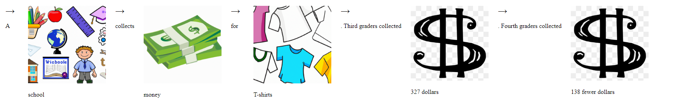

this project aims to help students with visual learning tendencies. it turns math word problems into illustrations.
Example : 

the model checkpoint is too large for github so you can find it [here](https://drive.google.com/drive/folders/1z8cKwFoR1Wp0ak03ukbthDk6U07IkEMz?usp=sharing) 
